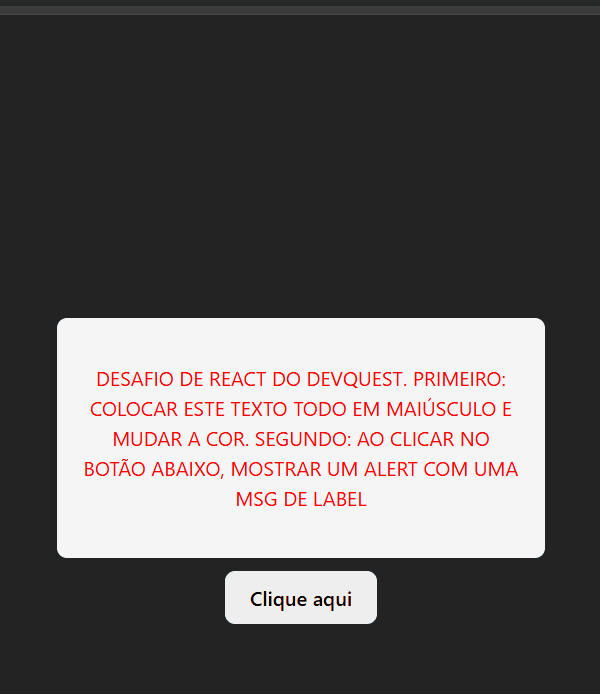

<h1 align="center"> DevQuest </h1>

Desafio proposto de React do curso DevQuest.

 

  

## 🚀 Tecnologias

Esse projeto foi desenvolvido com as seguintes tecnologias:

-   HTML
-   CSS
-   JavaScript
-   React
-   Github

## 💻 Projeto

Desafio de #frontend com foco em React do Curso DevQuest.
 

-   Primeiro: Fazer um parágrafo colocando todas as letras em maiúsculo e mudando a cor.
      
-   Segundo: Fazer um botão e ao clicar abrir um alert com a mensagem 'A label desse botão é Baixar CV'

---
